::::::::::::::::::::::::::::::::::::::: objectives

- - - 
::::::::::::::::::::::::::::::::::::::::::::::::::

:::::::::::::::::::::::::::::::::::::::: questions

- - - 
::::::::::::::::::::::::::::::::::::::::::::::::::

Tools for organizing and sharing scientific data can be also be helpful when
managing resources and peoples.

Have a look some of the features of GitHub a version control system and Benchling an electronic
lab notebook.

## GitHub

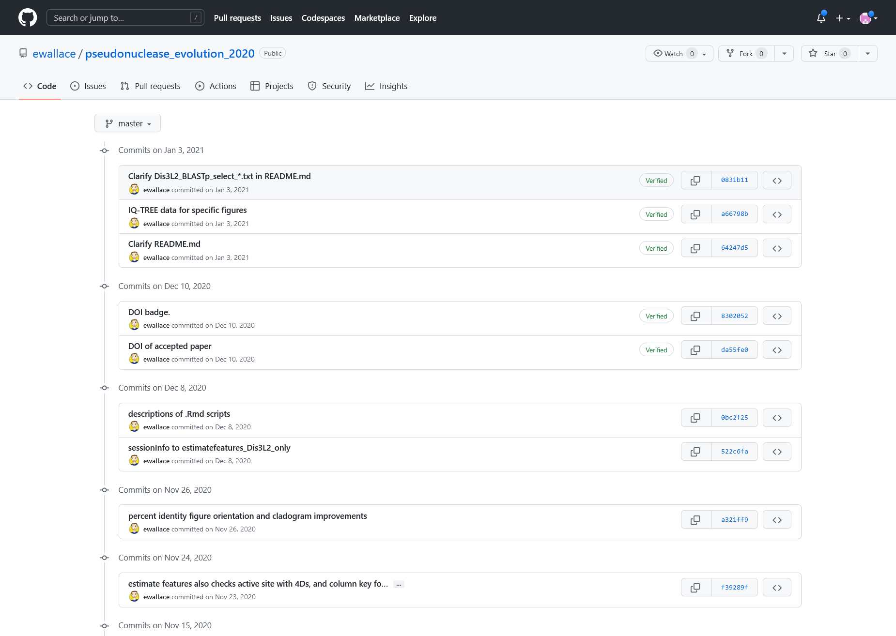{alt='Git change log'}

*ChangeLog, screen presenting list of changes made to the project (with author and dates)*

***

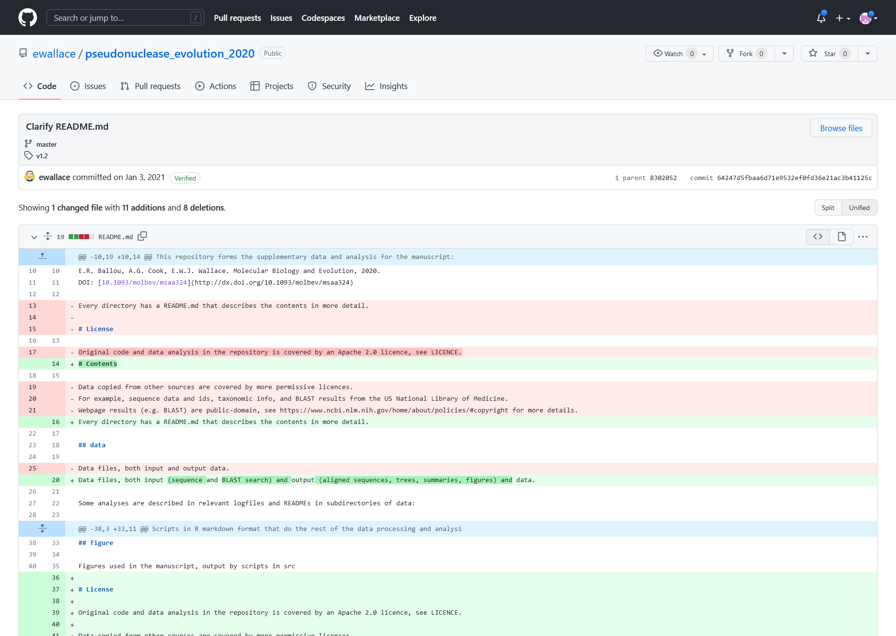{alt='Git entry documenting change'}

*Change Entry details. Showing the description message, affected file and the nature of change marked in colors.  
The red with '-' are sections which have been removed and the green with '+' are new content.*

***

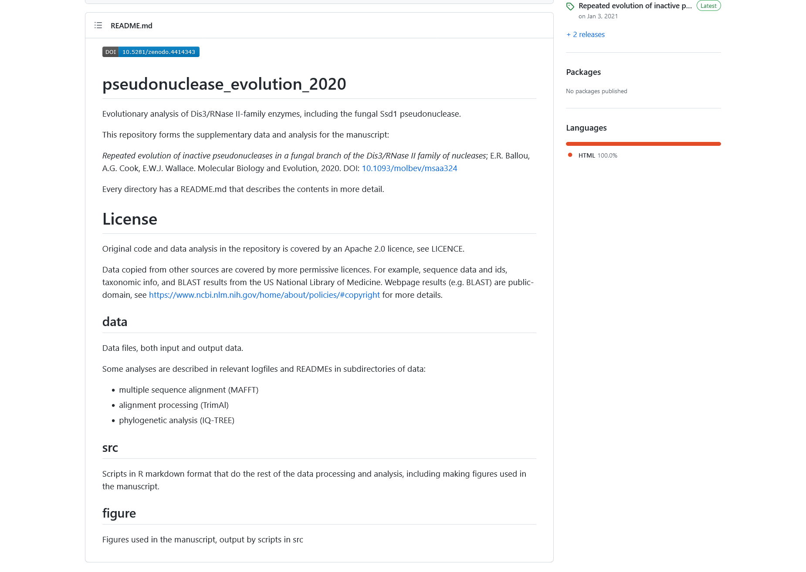{alt='View of readmefile'}

*The content of readme file before applying the changes from the change log entry above*

***

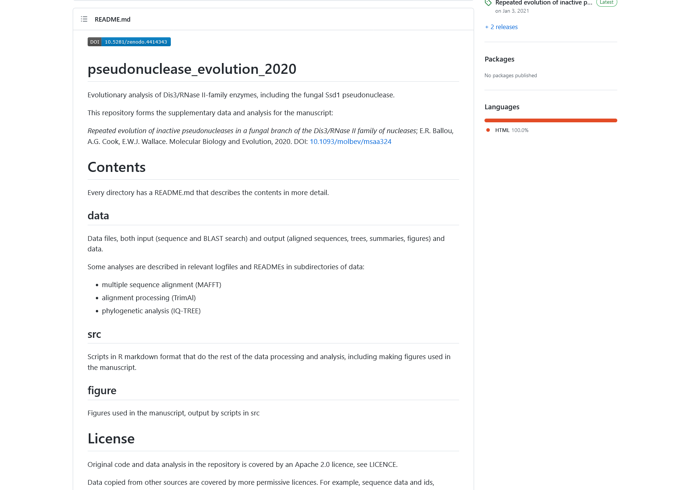{alt='View of readmefile'}

*The content of readme file after applying the changes from the change log entry above*

***

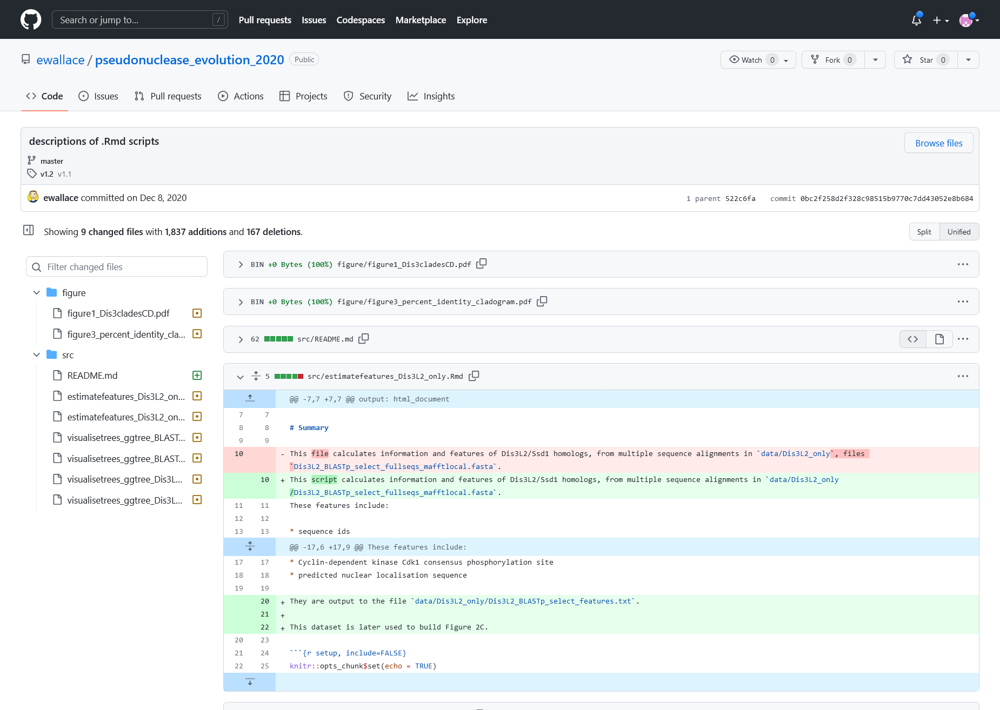{alt='Change entry for multifiles'}

*Log Entry details for a multi-file change. Affected files are listed on the left, the nature of change can be previewed
in the middle panel*

***

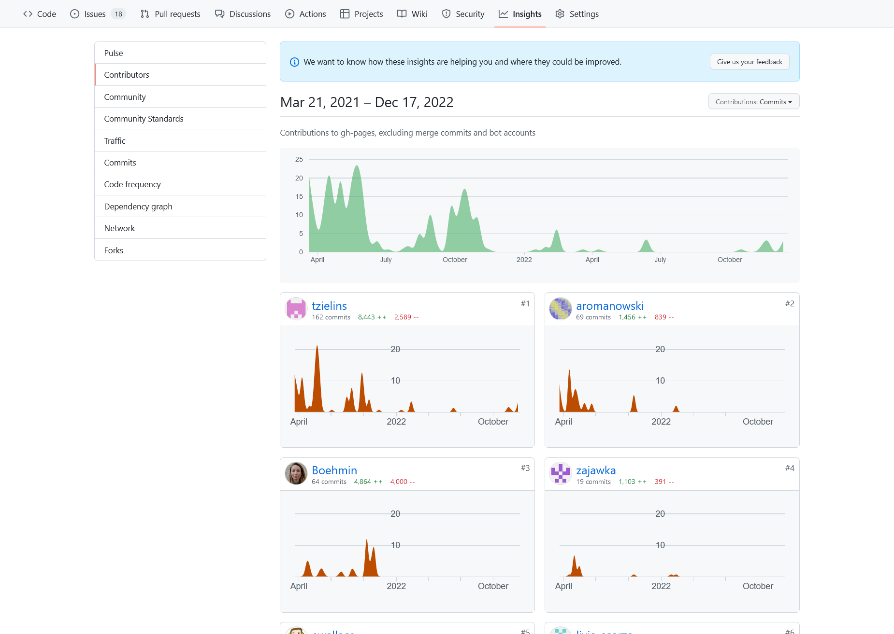{alt='Contribution view'}

*View of the activity for the development of teaching materials for "FAIR in practice".  
There is visible summer drop of contributions due to the holiday seasons.
Then the are burst of activities just before and after of dealivering that workshop.*

***

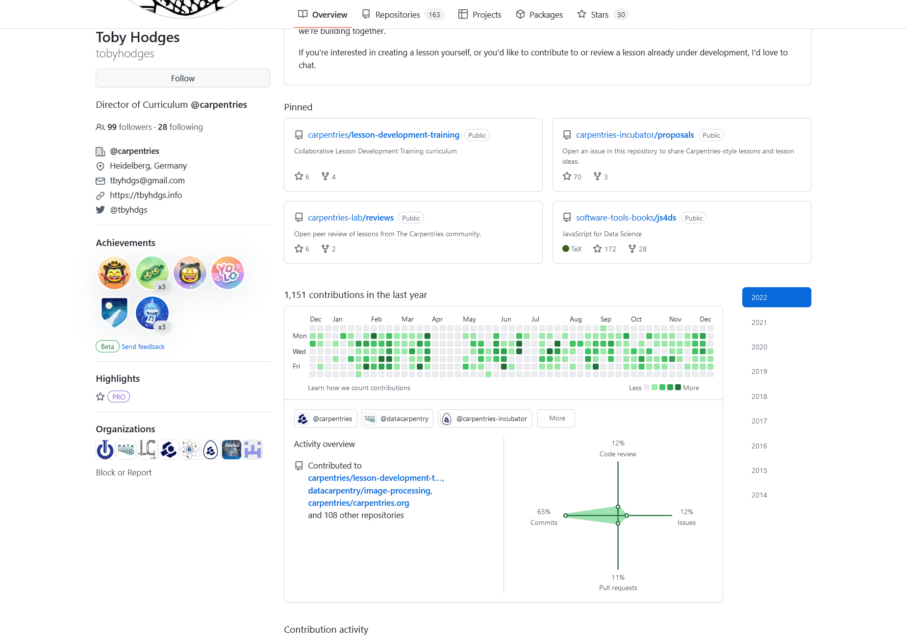{alt='GitHub personal page'}

*GitHub page for one of the carpentries editor, show his involvement in multiple open projects*

## Benchling

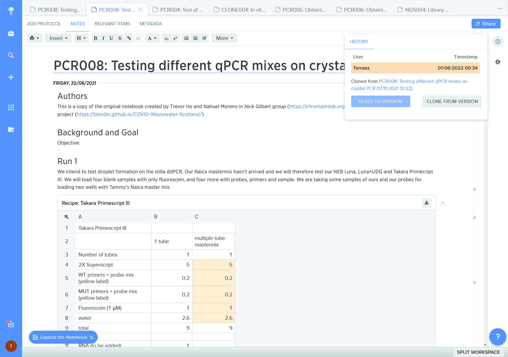{alt='Benchling record with provenance'}

*ELN record with provenance information; it is a clone ie a copy of another record*

***

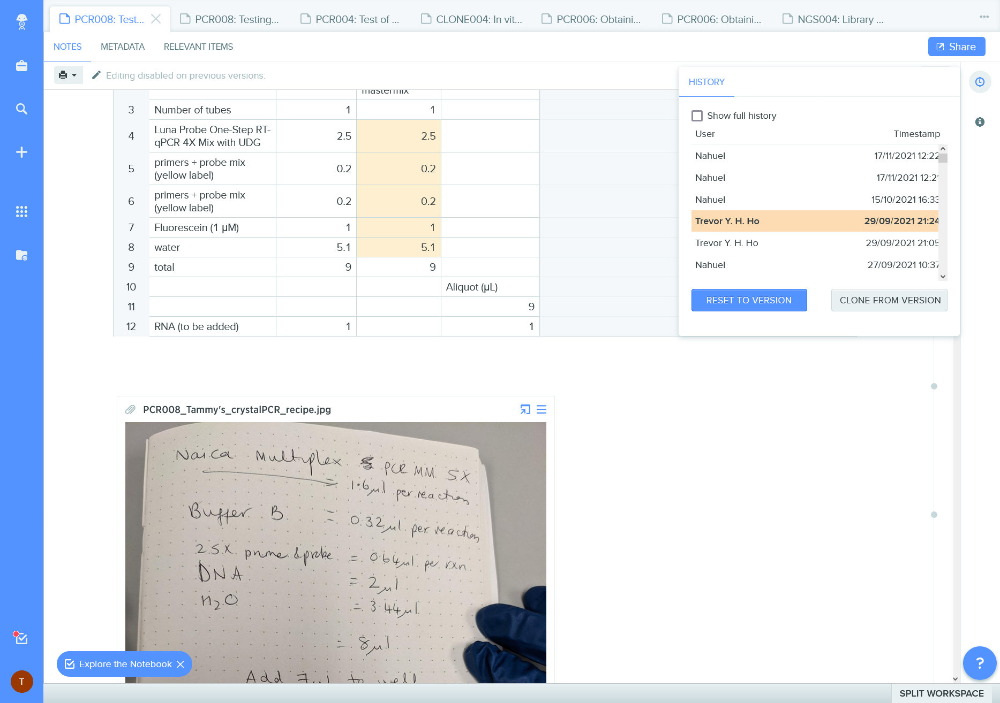{alt='History of changes'}

*Benchling change record documents authorship of edits and permits a quick "time travel" to the earlier versions.  
It misses the description message of the changes.*

***

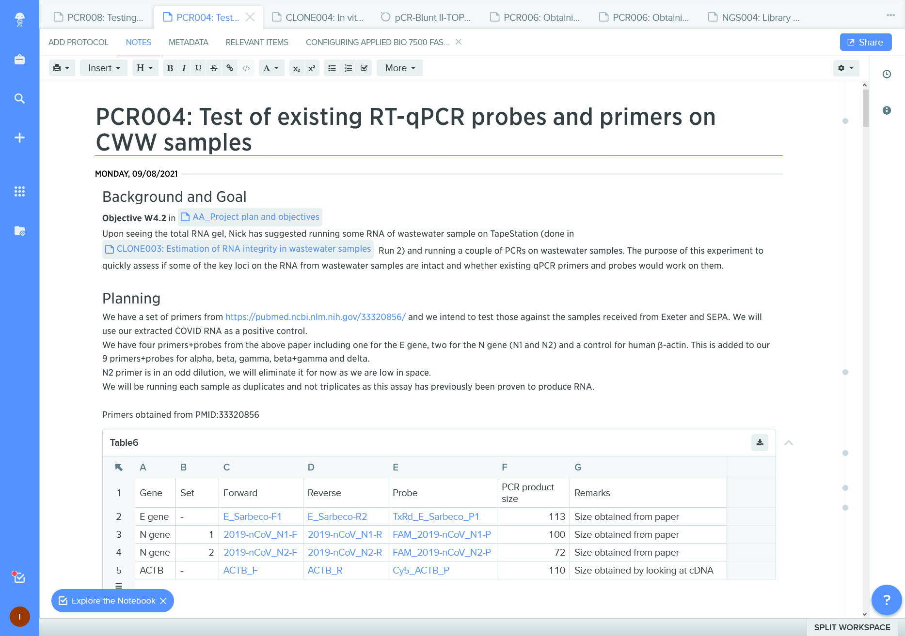{alt='Benchling data links'}

*ELN records can contain links to other documents / information systems*

***

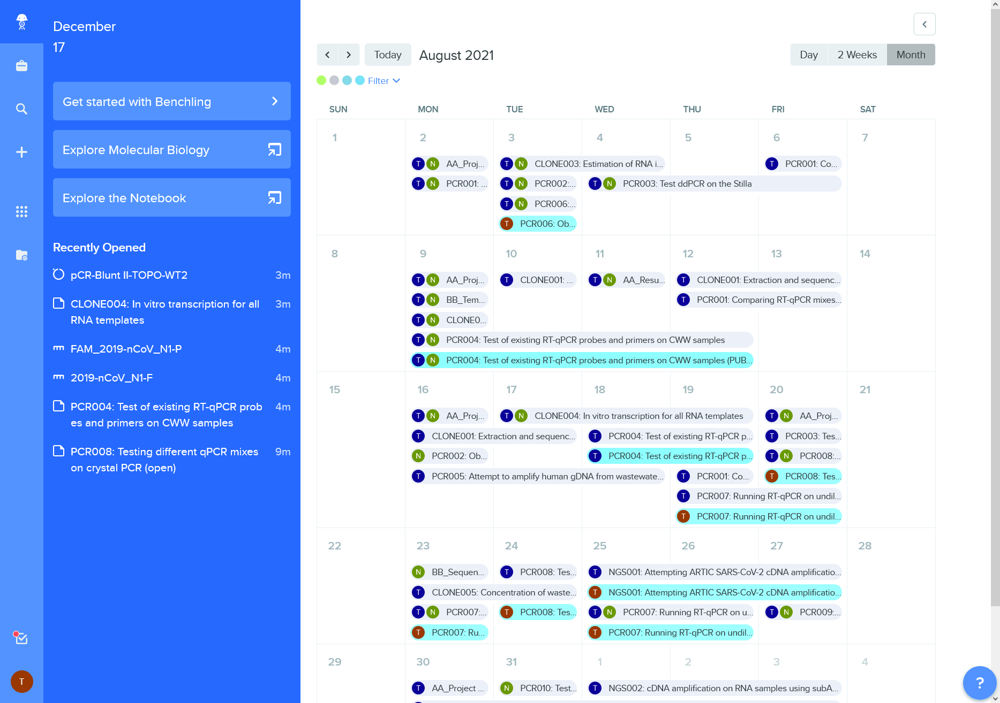{alt='Calendar'}

*Calendar view of lab activities*

***

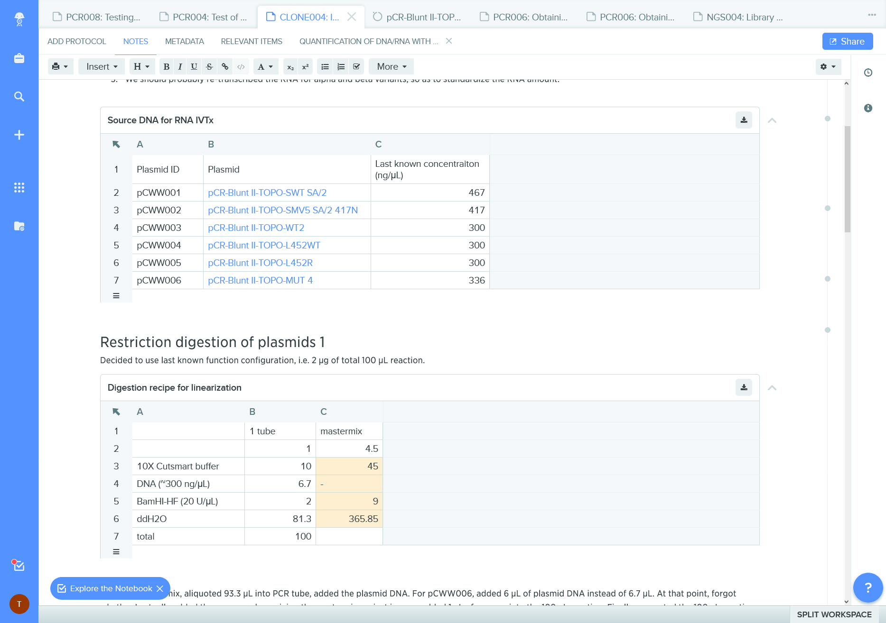{alt='Plasmid references'}

*References to iventory of biological materials*

***

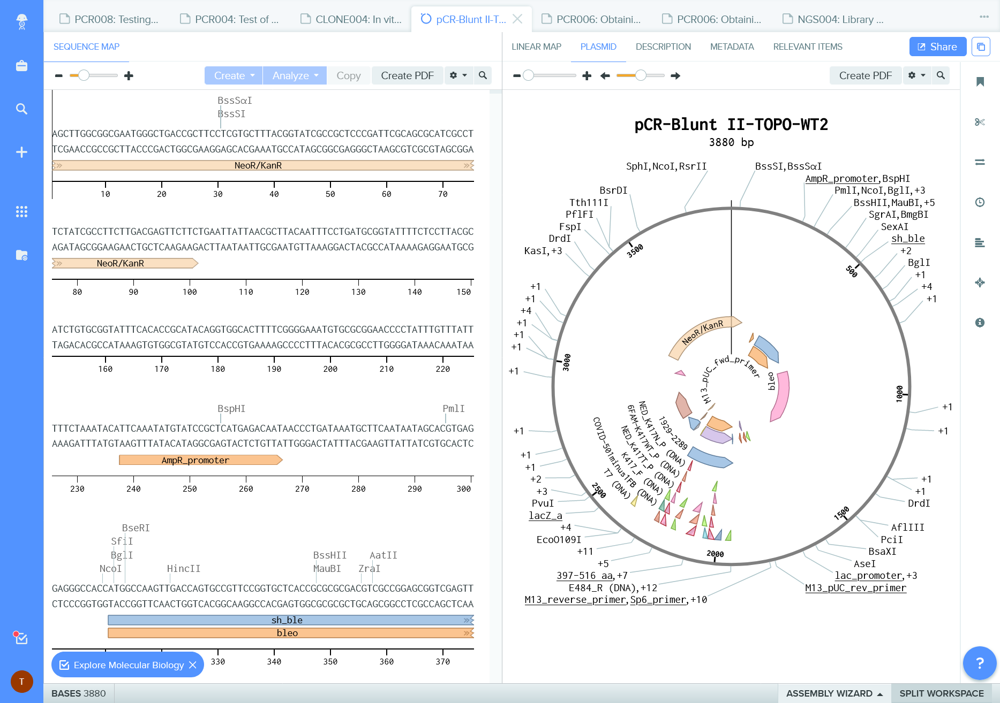{alt='Plasmid map'}

*Embeded tools and visualizations for molecular biology*

### More text will come :)

:::::::::::::::::::::::::::::::::::::::: keypoints

- - - 
::::::::::::::::::::::::::::::::::::::::::::::::::

